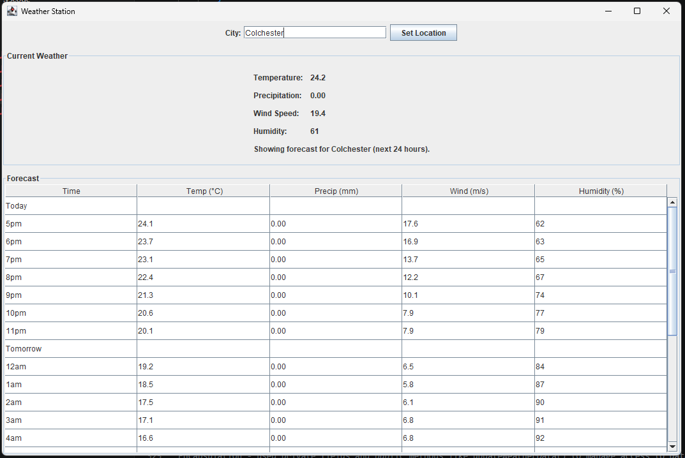

# Java Weather Station

A Java desktop application that displays weather information using real-time weather data.  
This project was developed to practise object-oriented programming, API integration, and GUI development.

## Features

- Search/display weather for a location
- Shows temperature and weather conditions
- Graphical user interface
- Uses weather API data
- Error handling for invalid input/API issues

## Technologies Used

- Java
- Java Swing / JavaFX
- Open-Meteo API
- Git & GitHub

## Screenshots



## How to Run

1. Clone the repository:

```bash
git clone https://github.com/MrJaaaaakey/Java-weather-station.git
